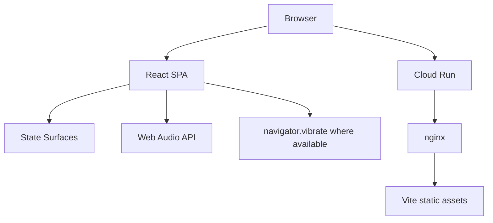
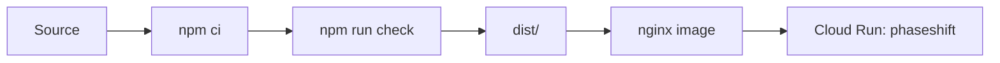

# PhaseShift Architecture

Last updated: 2026-04-22

## Summary

PhaseShift is a static React SPA served by nginx in a Cloud Run container. The browser owns all current behavior: state navigation, protocol timers, generated audio, and static content rendering.

There is no backend, database, auth service, analytics collector, or private API dependency.

Source repository: `https://github.com/zNeuralNetworks/PhaseShift`.



## Runtime Boundaries

| Layer | Responsibility |
| --- | --- |
| `App.tsx` | Owns active `PhaseRoute`, renders state rail, lazy-loads state surfaces and Roadmap |
| `components/Navigation.tsx` | Horizontal state rail for six states plus Roadmap |
| `components/StateSurface.tsx` | Shared action-first surface and local protocol session state |
| `components/Roadmap.tsx` | Static product roadmap |
| `data/states.ts` | State IA and action model |
| `data/protocols.ts` | Static protocol content and sound presets |

## Architectural Principles

- Static/offline behavior first.
- State pages are action surfaces, not dashboards.
- Keep protocol defaults local and deterministic.
- Do not add global state until route-level persistence or shared preferences require it.
- Do not introduce backend services or secrets for current functionality.
- Split protocol components when interaction depth grows.

## State Architecture

Current state is local React state:

| State | Owner |
| --- | --- |
| Active route | `App.tsx` |
| Active protocol session | `StateSurface.tsx` |
| Selected secondary action | `StateSurface.tsx` |
| Audio context lifecycle | `StateSurface.tsx` |
| Roadmap data | `Roadmap.tsx` |

## Build And Deploy



Required verification:

```bash
npm run check
```

For container changes:

```bash
docker build -t phaseshift:local .
docker run --rm -p 8080:8080 phaseshift:local
```

## Future Refactor Boundary

If protocol logic expands, split `StateSurface.tsx` into:

```text
components/protocols/
  BreathingProtocol.tsx
  SoundscapeProtocol.tsx
  NsdrProtocol.tsx
  SecondaryActionDetail.tsx
  protocolAudio.ts
```

Keep the state IA in `data/states.ts` so product structure remains data-driven.
