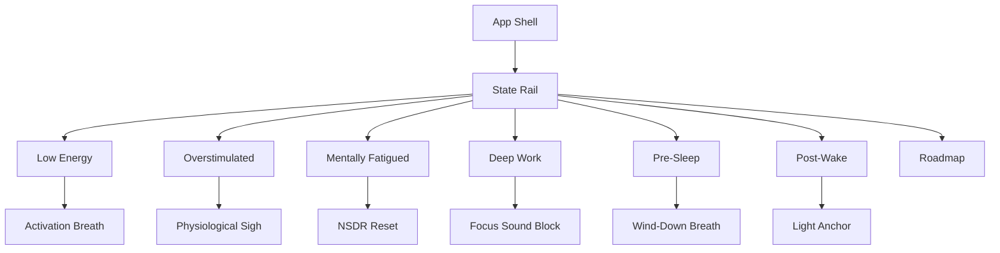

# PhaseShift Product Design

Last updated: 2026-04-22

## Summary

PhaseShift is a state-based performance utility built around fast, actionable state shifts. The product starts from the user state, not from dashboards, scores, or a library of wellness tools.

Core value: users can open the app, identify their state, and start one useful protocol in seconds.

## Positioning

| Dimension | Decision |
| --- | --- |
| Category | State-shift performance utility |
| Primary device | Mobile web |
| Interaction model | State first, one-tap protocol second, optional depth third |
| Data posture | Static/offline, no account, no tracking, no backend |
| Product boundary | Acute state shifts under roughly 10 minutes, except intentional Deep Work blocks |

PhaseShift is not a health tracker, diagnosis tool, sleep-only app, meditation catalog, productivity suite, or recommendation engine.

## Information Architecture

## State Design

| State | User Intent | Desired Outcome | Primary Protocol | Secondary Actions |
| --- | --- | --- | --- | --- |
| Low Energy | Needs activation | More alert without jitter | 90-second activation breath | Bright light, posture reset, first task |
| Overstimulated | Needs downshift | Lower arousal and reduce input | Physiological sigh | PMR, brown noise, shuffle words |
| Mentally Fatigued | Needs recovery | Restore cognitive capacity | Rapid NSDR | Alpha wash, walk cue, body scan |
| Deep Work | Needs focus entry | Protected work block | Focus sound block | Single target, input shutdown, longer block |
| Pre-Sleep | Needs sleep onset support | Wind down without analysis | Wind-down breath | Story, sleep timing, room audit |
| Post-Wake | Needs wake activation | Clear sleep inertia | Light anchor sequence | Caffeine timing, movement cue, circadian anchor |

## UX Principles

- One hero action per state.
- No state page should become a feature gallery.
- Secondary actions are capped at three.
- Educational copy stays below actions and remains short.
- Active sessions should be visually dominant and low-cognition.
- Sleep remains a core function through Pre-Sleep and Post-Wake, not the whole product identity.

## Content Voice

Use direct performance-state language: activate, downshift, recover, lock in, wind down, wake cleanly.

Avoid clinical certainty and unsupported claims. Preferred phrasing: "may support", "designed for", "use when". Avoid: "cures", "treats", "diagnoses", or score-based judgment.

## Risks

| Risk | Mitigation |
| --- | --- |
| Becoming too broad | Only add tools tied to a defined state and immediate action |
| Becoming a tool catalog | Keep one default hero protocol per state |
| Dashboard creep | Keep metrics and explanations below actions |
| Weak state differentiation | Give every state a distinct outcome and primary protocol |
| Losing sleep strengths | Preserve sleep content inside Pre-Sleep/Post-Wake |
